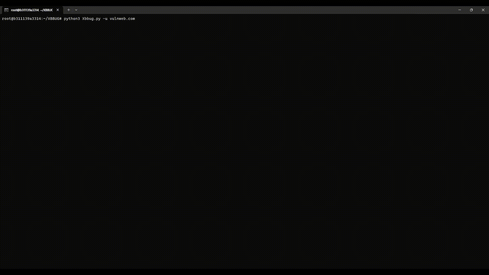
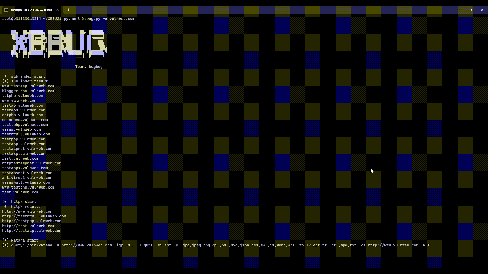
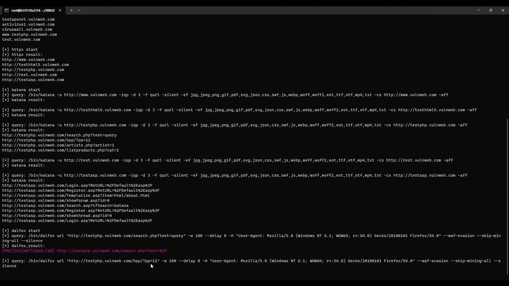

<h1 align="center">XBBUG</h1>

The XBBUG is an open source framework that automatically scans for Cross Site Scripting(XSS) vulnerabilities.

The XBBUG framework uses Subfinder, httpx, Katana, and Dalfox tools.

The XBBUG Framework supports:

-   Find subdomains using subfinder and httpx tools.
-   Find endpoints and parameters using Katana tools.
-   Detect XSS vulnerabilities using the Dalfox tool.

<h2>Flowchart</h2>

<br/>

<h2>Getting started</h2>

```sh
sh setup.sh
```

<h2>XBBUG Framework Guide</h2>

-   [guide-ko-documentation](./GUIDE_ko.md)
-   [guide-en-documentation](./GUIDE_en.md)

#### (1) Find subdomains.



#### (2) Find endpoints and parameters.



#### (3) Detect XSS vulnerabilities.



<h2>Reference</h2>

-   subfinder(https://github.com/projectdiscovery/subfinder)

-   httpx(https://github.com/projectdiscovery/httpx)

-   katana(https://github.com/projectdiscovery/katana)

-   Dalfox(https://github.com/hahwul/dalfox)

<h2>Contact</h2>

-   whitehacker.roronoa@gmail.com

<h2>Contributor</h2>

-   Jeongwoo Lee ([@Roronoawjd](https://github.com/Roronoawjd))
-   Seongmin Yoon ([@Potato12351](https://github.com/Potato12351))
-   Hongjun Seo ([@hjthink2](https://github.com/hjthink2))
-   Yeonjun Park ([@yeo0n](https://github.com/yeo0n))
-   Seunghwan Lee ([@EL55](https://github.com/EL55))
-   Minjun Bae ([@bmj4004](https://github.com/bmj4004))
-   PL: Sanghyun Lee ([@isanghyeon](https://github.com/isanghyeon))
-   Mentor: Joowon Kim ([@arrester](https://github.com/arrester))

<h2>Acknowledgement</h2>

This work was supported by Korea Information Technology Research Institute (KITRI) WhiteHat School Program 1st.

**[Project Name: Bug bounty optimization through web automation tool analysis]**
